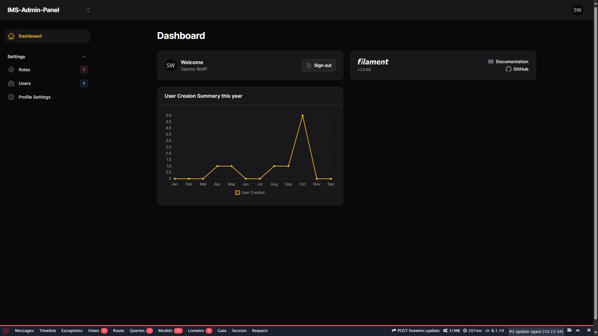

## About this project

`ims-laravel-admin-starter` is a streamlined Admin panel & API starter application built using the powerful [Laravel 10](https://laravel.com/) framework and [Filment 3](https://filamentphp.com/).

Our primary focus is to provide you with a hassle-free and ready-to-use local development starter project.

Unlike traditional API generators or code generators, this project simplifies the process of setting up your local development environment. It enables you to jumpstart your Laravel-based API development and admin panel development without unnecessary complexities. This allows you to focus on building your application logic rather than spending time on initial setup.




## Features

-   **Full Authentication System**: Implement a robust authentication system using [Laravel Jetstream](https://jetstream.laravel.com/introduction.html) package for secure user management and login functionality.

-   **Role and Permission-based Authorization System**: Create a flexible authorization system using the [Laravel-Permission](https://spatie.be/docs/laravel-permission/v5/introduction) package, allowing you to define roles and permissions for fine-grained access control.

-   **User Management**: Manage users efficiently, including user registration, profile updates, and user roles.

-   **Profile Settings**: Enable users to customize their profiles, including personal information and preferences.

-   **Multiple Language Support**: Make your application accessible to a global audience with the help of [Filament Translations](https://filamentphp.com/docs/3.x/panels/installation#publishing-translations) and [Laravel Lang](https://laravel-lang.com/) packages for multilingual support.

-   **Theme Customization**: Customize the application's appearance and user interface using the power of [Tailwind CSS](https://tailwindcss.com/) to create visually appealing designs.

-   **Docker Support**: Easily deploy and manage your application in a Docker container with the convenience of [Laravel Sail](https://laravel.com/docs/10.x/sail) for streamlined development and deployment workflows.

## Version Requirments

-   Node 16+
-   PHP version 8.1+
-   MYSQL version 8.0+

## Quick Start

1. **Choose Your Local Development Tool:**

    Select your preferred local development tool, such as [Laragon](https://github.com/leokhoa/laragon), XAMPP, WAMP, or any other tool that suits your needs.

2. **Configure Your Environment:**

    Update your `.env` file with the correct database credentials.

3. **Install Dependencies:**

    Run the following command to install required dependencies using Composer:

    ```bash
    composer install
    ```

    Run the following command to install required dependencies using npm and build them:

    ```bash
    npm install
    npm run build
    ```

4. **Migrate and Seed the Database:**
   Initialize and seed the database with default data using:

    ```bash
    php artisan migrate --seed
    ```

    Now, your project is ready for use. You can access the admin panel via the provided route. If you've run the seed command, log in with the provided credentials. Customize and expand your application as needed.

## Accessing the Admin Panel

Once you have set up the Project using the provided instructions, you can access the admin panel by visiting the `/admin` route in your web browser.

### Logging In

If you have run the seed command during the setup process, you can log in using the following credentials:

```bash
email: superadmin@ims.com
password: 123456

email: admin@ims.com
password: 123456
```

### Role and Permission-Based Operations

The `ims-laravel-admin-starter` supports role and permission-based operations to control access to various functionalities within your admin panel. You can define roles with specific permissions and assign them to users as needed.

Explore this project and experience the convenience of a ready-made local development environment for your Laravel-based APIs and Admin Panels.

### Multilingual Support

Elevate the accessibility and user-friendliness of this Starter Project by embracing multiple languages. With the assistance of [Filament Translations](https://filamentphp.com/docs/3.x/panels/installation#publishing-translations) and the [Laravel Lang](https://laravel-lang.com/) package, this Starter Project offers comprehensive multilingual support.

For a detailed guide on working with multiple languages and translations, visit our dedicated [wiki page](https://github.com/Innovix-Matrix-Systems/ims-laravel-admin-starter/wiki/Working-with-Multiple-Language-Guide).

Unlock a world of possibilities with seamless language localization, ensuring your application resonates with a global audience.

## Running the Application with Docker and Laravel Sail

For a more comprehensive guide, please visit the [WIKI](https://github.com/Innovix-Matrix-Systems/ims-laravel-admin-starter/wiki/Running-the-Application-with-Docker-and-Laravel-Sail) page on GitHub:

[Running the Application with Docker and Laravel Sail - Wiki](https://github.com/Innovix-Matrix-Systems/ims-laravel-admin-starter/wiki/Running-the-Application-with-Docker-and-Laravel-Sail)

This detailed resource provides step-by-step instructions and additional information to ensure a smooth experience when setting up and running your application with Docker and Laravel Sail.

## Running Test

To ensure the reliability and correctness of your application, it's essential to execute tests. Follow these simple steps:

1. **Create a Separate Test Database:**

    Start by creating a dedicated test database for your application. You can name it `ims-admin-testing` to keep it distinct from your production database.

    If you're using Docker and Laravel Sail, you can skip this step and instead update the phpunit.xml file to add a testing database:

    ```xml
    <env name="DB_DATABASE" value="testing"/>
    ```

2. **Run Tests:**

    You have two convenient options for running tests:

    - **Using Pest:**

        Execute tests with Pest, a delightful PHP testing framework. Simply run the following command:

        ```bash
        ./vendor/bin/pest
        ```

        If you are running with Sail, you can use this command:

        ```bash
        ./vendor/bin/sail test
        # or if you have an alias configured:
        sail test
        ```

    - **Using Artisan:**

        Laravel's Artisan command-line tool provides seamless testing capabilities. Run the tests with the following Artisan command:

        ```bash
        php artisan test
        ```

        If you are running Sail, you can use this command:

        ```bash
        ./vendor/bin/sail artisan test
        # or if you have an alias configured:
        sail artisan test
        ```

Running tests is crucial to ensure the reliability and correctness of your application's functionality. The above commands will initiate the testing process and provide you with valuable insights into the quality of your codebase.

## Performance Tips

Some Performance Tips for Filament

### Icon cache

To optimize the performance of the Filament app, you can use the `php artisan icons:cache` command to cache icons. This command preloads and caches the icons used in your application, resulting in faster load times.

```bash
php artisan icons:cache
```

### Disabling View Collection in Debugbar

If you're experiencing performance issues and want to speed up your application, consider disabling the view collection feature in the Debugbar. Here's how you can do it:

1. Navigate to the `debugbar.php` configuration file located in the `config` directory of your app.

2. Inside the `debugbar.php` file, you'll find an array named `collectors`. Locate the `'views'` collector within this array.

3. To disable the view collection, simply set the `'views'` collector to `false`, like this:

```php
'collectors' => [
    ...
    'views' => false,  // Views with their data
],
```

This change will prevent the Debugbar from collecting and displaying view data, which can help improve the performance of your application, particularly in a development environment.

## Extra Artisan Commands

This project provides additional Artisan commands to simplify your workflow and enhance productivity.

### Generate IDE Helper Files:

Generate general IDE helper files for improved code autocompletion and navigation by running:

```bash
php artisan ide-helper:generate
```

Generate IDE model helper files without writing to model files using:

```bash
#use any one of this two commands
php artisan ide-helper:models -N
php artisan ide-helper:models --nowrite
```

### Run PHP CS Fixer

```bash
php artisan csfixer:run
```

This command ensures that your code adheres to the predefined coding standards, making your codebase clean and readable.

### Create a Service

Creating services for your application is made effortless. Use the following command to generate a service:

```bash
php artisan make:service subfolder/ServiceName
```

Replace subfolder and ServiceName with the actual values you need. You can also create a service without a subfolder:

```bash
php artisan make:service TestService
```

The newly created service will be located at `app/Http/Services/TestService.php`, ready to handle your application's business logic.

### Generate a Trait

Traits are reusable code components that enhance code organization. To create a new trait, simply run:

```bash
php artisan make:trait TestTrait
```

This command generates a new trait file for your project, promoting code reusability and maintainability.

Leverage these Artisan commands to streamline your development process and maintain a well-structured codebase.

## Authors

-   [@AHS12](https://www.github.com/AHS12)

## License

This project is brought to you by Innovix Matrix System and is released as open-source software under the [MIT license](https://opensource.org/licenses/MIT).

Feel free to use, modify, and distribute this starter project in accordance with the MIT license terms. We encourage collaboration and welcome contributions from the community to make this project even better.
